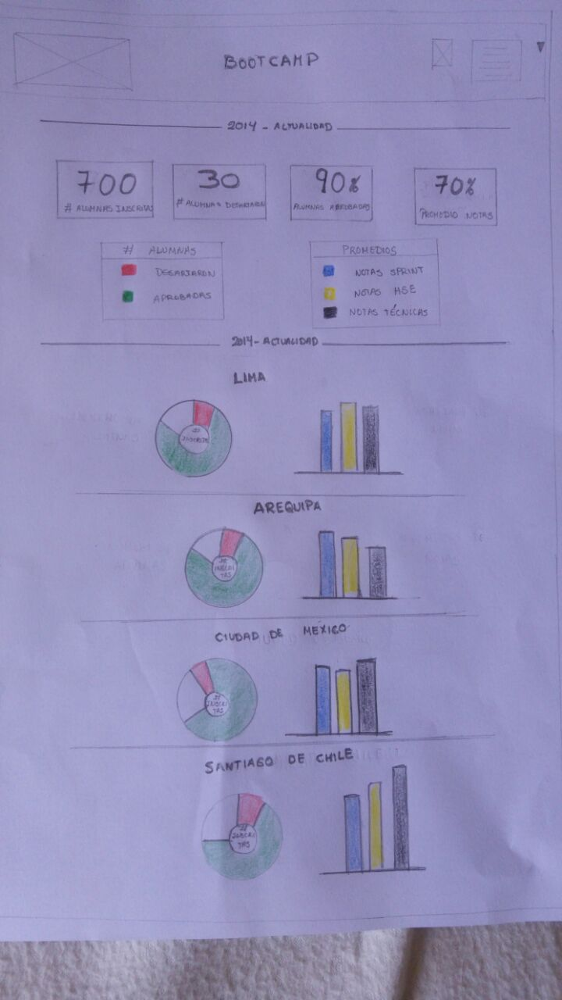
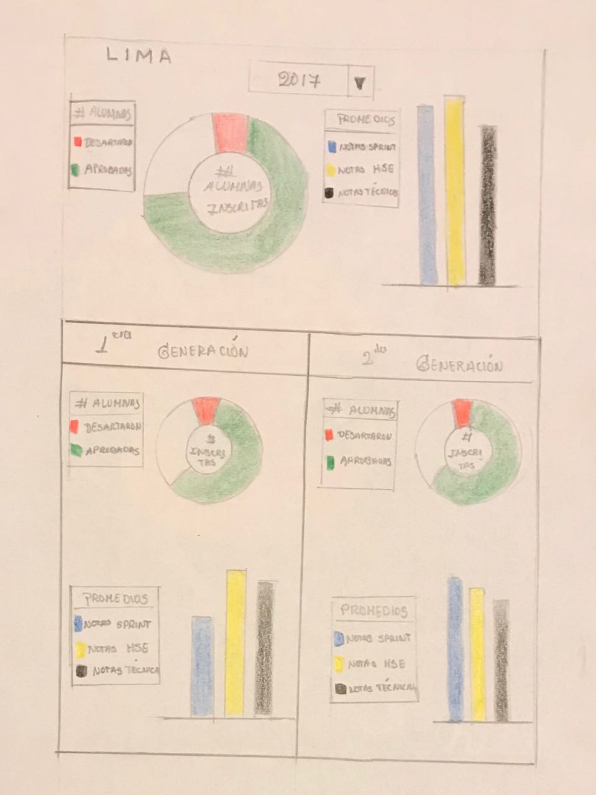

# Dashboard para Laboratoria
## Objetivo 
Hacer un sketch para la herramienta del dashboard de laboratoria. Donde puedan ver rápidamente las estadísticas de todas las sedes.
1. SEDES

    * Lima 
    * Arequipa
    * Ciudad de México
    * Santiago de Chile

* Número de alumnas inscritas
* Número de alumnas que desertaron
*  % de alumnas que pasan el criterio mínimo de evaluación (aprobadas)
* Promedio de notas por sprint
* Promedio de notas HSE
* Promedio de notas técnicas
***

***
Este es un popup, saldrá cuando el usuario le de click en las sedes. 
Donde mostrara más a detalle las estadísticas por año y por generaciones.

***
